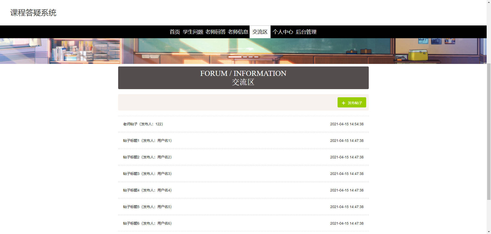

# 基于Springboot的课程答疑系统

## Springboot-0059


## 技术栈

Springboot mybatisplus vue mysql maven


## 数据库表(15张)


## 功能介绍

```properties
管理员功能有，个人中心，学生管理，老师过来，科目类型管理，学生问题管理，老师回答管理，老师信息管理，关注列表管理，交流区，系统管理。

学生功能有，个人中心，科目类型管理，学生问题管理，老师回答管理，老师信息管理，关注列表管理，我的收藏管理。

老师功能有，个人中心，老师回答管理，老师信息管理，关注列表管理，我的收藏管理。
```


## 图片

### 前台





### 后台


## 访问路径

### 前台

```properties
http://localhost:8080/springboot7vkr1/front/pages/login/login.html

账号 12
密码 12
```

### 后台

```properties
http://localhost:8080/springboot7vkr1/admin/dist/index.html#/login

账号 abo
密码 abo
```


## 功能图


## 文档目录


## 打赏或交流


